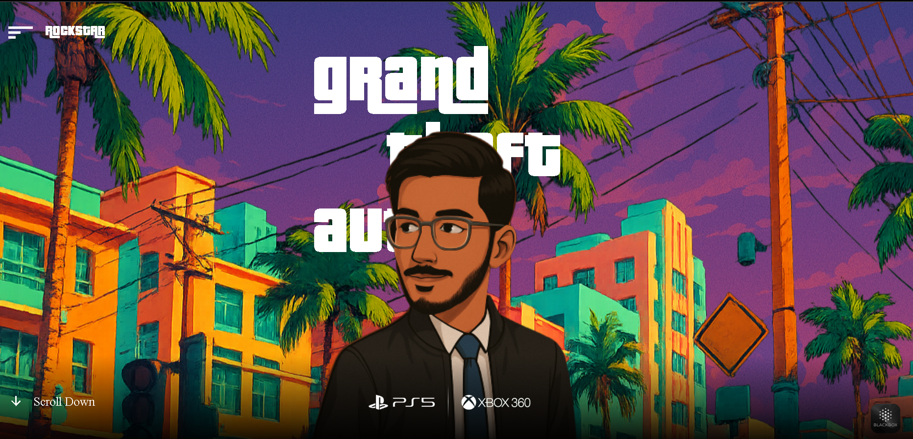

# GTA-VI-GSAP 🚗🔥

An animated GTA VI-themed landing page built using **React.js** and **GSAP (GreenSock Animation Platform)**.  
This project showcases a creative introduction animation, responsive layout, and immersive character visuals, inspired by the Grand Theft Auto franchise.

## 🚀 Live Preview

## 🛠️ Tech Stack

- **React.js** – Frontend framework
- **GSAP (GreenSock)** – For animations and transitions
- **Tailwind CSS** – For styling (optional but used for utility-first design)
- **Remix Icons** – For UI icons

## 📸 Features

- 🚀 Smooth SVG text reveal animation (`VI`)
- 🔄 Parallax scroll effects and mouse movement interaction
- 🎮 GTA VI-style character and cityscape visuals
- 📱 Responsive design
- 🎨 Animated headings and download CTA

